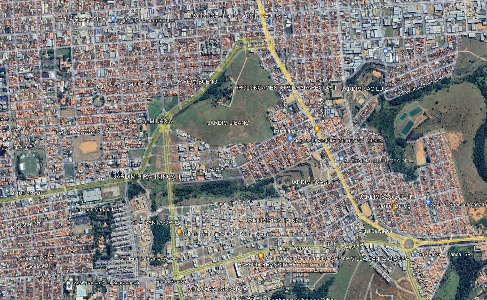

# Mariana

* Pela dimensão que possui a cidade de Franca, era de se esperar que tivesse mais parques. **Qual a relação areas verdes por habitante?** (Pag.3)

* Sistema de espaços livres: SEL - 

**Parque Urbano** - espaços de convívio entre as pessoas, promova ações de cultura e lazer, integre as partes desconectaads e sem vitalidade.

* Faltam algumas referências. Por ex. formação dos parques na Inglaterra sec X - pag. 7
* Retomar no texto, as Figuras que são colocadas. Por ex. Figura 2 - pag. 7
*  Pag. 8 citação do Leite. Colocar em aspas.
*  Figura 3 - Muito legal o diagram dos Parques e praças com vitalidade. Mas pensar no nosso contexto também. A sombra?
*  Riqueza EspaCial
**  Pág. 9 *foram realizadas inúmeras tentativas para restabelecer a visão integrada da paisagem, através da elaboração de novos métodos, abordagens e formas de interpretação. Sendo assim, a paisagem urbana também vem sendo enfocada como um importante ponto sob a percepção humanística, que procura valorizar a experiência do indivíduo e do grupo visando compreender a percepção e os afetos dos indivíduos em relação às paisagens.* REF.
* Item 1.4 pode virar parte do proprio capitulo anterior p/ não quebrar a narrativa. Inserir uma discussão final.
* Densidade demografica - rever valor. população estimada de 358.539 habitantes, ocupa uma área de 605,679 km2 e tem uma densidade demográfica de 526,09 hab/km2. conflita com Figura 36.
* Interessante crítica sobre a expansão urbana da cidade. -->  Mas como a discussão se reflete na qualidade dos espaços livres da cidade?
* Mapa pag. 19 Escala e Norte / Talvez inserir isocronas?
* Foto aerea? Glauco comprar um drone rs.
* Cheios e vazios, fazer mesmo com edificações.
* classificar areas verdes pag. 31
* Referencias: Linear e Ecoparque - China
* Ótima síntese das referências. Figura 80 Expecíficos!!! Corrigir

